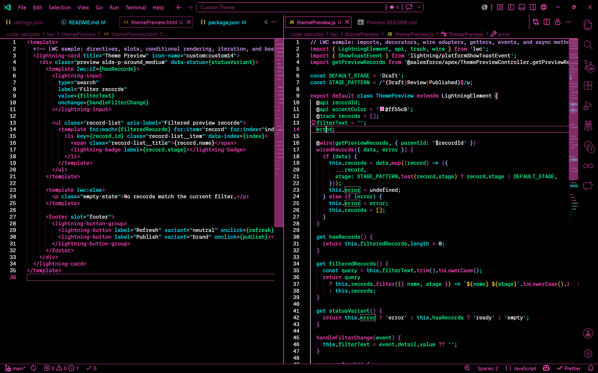

> [!NOTE]
> This theme is in Beta. Please test it out and share feedback or contributions to help finalize it!

#  Klang Theme

>A high-contrast dark theme for Visual Studio Code built around clarity and readability. Every color is chosen to pop against a pure black background, so you can immediately make sense of what you're looking at.

## Philosophy

Code should be easy to read at a glance. Klang Theme keeps things simple — a small, deliberate palette where each color has a clear purpose. No subtle grays fighting for attention, no muted tones that blend together. Just distinct, vibrant colors on black so structure and meaning jump out instantly.

## Features

- **High contrast** — Pure black `#000000` backgrounds and Neon pink `#FF55C8` as the primary accent color. No muted colors that blend together.
- **Minimal palette** — a handful of colors with clear roles, so syntax and UI elements are instantly distinguishable.
- **Full coverage** :warning: *working on it* — workbench UI, editor, terminal, diff editor, merge editor, notebooks, debug views, SCM, and more are all themed.
<!-- TODO: Add full coverage -->
- **Rainbow bracket pairs** — bracket pair colors cycle through pink, yellow, green, cyan, blue, and purple for easy nesting visibility.

## Installation
The Theme is not yet published to the marketplace, but you can install it manually:

1. Download the .vsix file from the [latest release](https://github.com/jesperklang/klang-vscode-theme/releases).
2. In VS Code, open the Extensions view.
3. Click the three-dot menu in the top right > select **Install from VSIX...** > choose the downloaded file.
